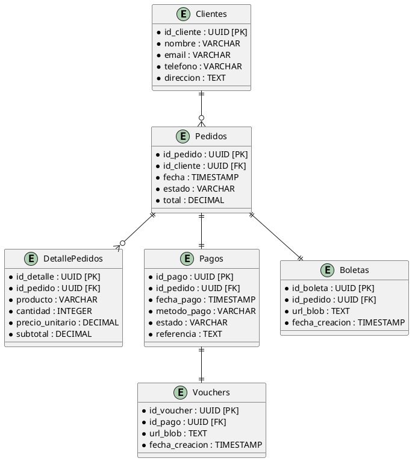

# SemanaSantaTripleC
# **Informe Final: Propuesta de Solución Escalable para Pedro**

---

## **Introducción**
Pedro requiere una solución escalable para gestionar pedidos, pagos y notificaciones en su negocio. La solución debe ser diseñada de manera que soporte un alto volumen de usuarios, garantice la seguridad y facilite la integración futura con otros sistemas. Este informe presenta una propuesta basada en microservicios, junto con una arquitectura física de tipo **3-tier** y **event-based** para garantizar escalabilidad, flexibilidad y mantenimiento eficiente.

---

## **Propuesta de Solución**

### **Arquitectura Física**
La arquitectura propuesta es una combinación de **3-Tier** y **Event-Based Microservices**, como se detalla a continuación:

1. **Capa de Presentación (Frontend)**:
   - Construido con **React.js** para ofrecer una interfaz de usuario interactiva y responsiva.
   - Se comunica con un **API Gateway** para gestionar todas las solicitudes del cliente.

2. **Capa de Lógica de Negocio (Backend)**:
   - Microservicios independientes para manejar diferentes funcionalidades:
     - Gestión de Pedidos.
     - Gestión de Pagos.
     - Gestión de Clientes.
     - Gestión de Proveedores.
     - Notificaciones.
   - Comunicación asíncrona mediante un sistema de mensajería (**RabbitMQ o Kafka**) para procesar eventos como "Pedido Creado" o "Pago Confirmado".

3. **Capa de Almacenamiento**:
   - Base de datos relacional (**PostgreSQL**) para datos estructurados como pedidos, clientes y pagos.
   - Base de datos NoSQL (**MongoDB**) para datos no estructurados como logs de notificaciones.
   - Almacenamiento en la nube (**Blob Storage**) para boletas y comprobantes.

---

### **Arquitectura Lógica**
La arquitectura lógica sigue un diseño basado en microservicios, que permite escalabilidad horizontal y desacoplamiento entre componentes. 

#### **Flujo Lógico**
1. El cliente realiza un pedido desde la aplicación web.
2. El **API Gateway** enruta la solicitud al microservicio correspondiente (**Gestión de Pedidos**).
3. El microservicio de **Gestión de Pedidos** guarda los datos en PostgreSQL y genera una boleta almacenada en Blob Storage.
4. El evento "Pedido Creado" es publicado en el sistema de mensajería.
5. Otros microservicios, como **Gestión de Pagos**, procesan el evento y actualizan el estado del pedido.

---

## **Arquitectura Técnica**

### **Diagrama Técnico**
```plantuml name=technical-architecture.puml
@startuml
skinparam componentStyle rectangle

actor Cliente
actor Administrador

package "Frontend" {
  [Web] <<React>>
}

package "API Gateway" {
  component "API Gateway"
}

package "Microservicios" {
  component "Gestión de Pedidos"
  component "Gestión de Pagos"
  component "Gestión de Clientes"
  component "Gestión de Proveedores"
  component "Notificaciones"
}

package "Mensajería" {
  component "RabbitMQ / Kafka"
}

package "Base de Datos" {
  component "PostgreSQL"
  component "MongoDB"
}

package "Almacenamiento" {
  component "Blob Storage (S3/Azure Blob)"
}

Cliente --> [Web]
Administrador --> [Web]

[Web] --> "API Gateway"

"API Gateway" --> "Gestión de Pedidos" : Crear/Consultar Pedido
"API Gateway" --> "Gestión de Pagos" : Procesar/Consultar Pago
"API Gateway" --> "Gestión de Clientes" : Registrar/Consultar Cliente
"API Gateway" --> "Gestión de Proveedores" : Consultar Proveedores

"Gestión de Pedidos" --> "RabbitMQ / Kafka" : Evento Pedido Creado
"Gestión de Pagos" --> "RabbitMQ / Kafka" : Evento Pago Confirmado
"Gestión de Proveedores" --> "RabbitMQ / Kafka" : Evento Proveedor Actualizado

"RabbitMQ / Kafka" --> "Gestión de Pedidos" : Notificar Actualización
"RabbitMQ / Kafka" --> "Gestión de Pagos" : Solicitar Validación
"RabbitMQ / Kafka" --> "Notificaciones" : Enviar Notificación

"Gestión de Pedidos" --> "PostgreSQL" : Guardar Pedido
"Gestión de Clientes" --> "PostgreSQL" : Guardar Información Cliente
"Gestión de Proveedores" --> "PostgreSQL" : Guardar Información Proveedor
"Gestión de Pagos" --> "PostgreSQL" : Guardar Transacción
"Notificaciones" --> "MongoDB" : Guardar Notificación

"Gestión de Pedidos" --> "Blob Storage (S3/Azure Blob)" : Guardar Boletas
"Gestión de Pagos" --> "Blob Storage (S3/Azure Blob)" : Guardar Vouchers
@enduml
```

---

## **Base de Datos**
El diseño de base de datos está optimizado para manejar relaciones entre pedidos, clientes y pagos, con una estructura relacional y soporte para datos no estructurados.

### **Diagrama UML de Base de Datos**


---

## **Leyenda de Métodos por Microservicio**
### **Gestión de Pedidos**:
- **POST /pedidos**: Crear un nuevo pedido.
- **GET /pedidos/{id}**: Consultar un pedido por su ID.
- **GET /pedidos**: Listar todos los pedidos.

### **Gestión de Pagos**:
- **POST /pagos**: Procesar un nuevo pago.
- **GET /pagos/{id}**: Consultar un pago por su ID.
- **GET /pagos**: Listar todos los pagos.

### **Gestión de Clientes**:
- **POST /clientes**: Registrar un nuevo cliente.
- **GET /clientes/{id}**: Consultar un cliente por su ID.
- **GET /clientes**: Listar todos los clientes.

### **Gestión de Proveedores**:
- **GET /proveedores/{id}**: Consultar un proveedor por su ID.
- **GET /proveedores**: Listar todos los proveedores.

### **Notificaciones**:
- **POST /notificaciones**: Enviar una nueva notificación.
- **GET /notificaciones/{id}**: Consultar una notificación específica por su ID.
- **GET /notificaciones**: Listar todas las notificaciones.

---

## **Conclusiones**

### **Por qué elegimos 3-Tier, Event-Based, y Microservices**

1. **3-Tier:**
   - Permite una **separación clara de responsabilidades** (presentación, lógica de negocio y almacenamiento), facilitando el mantenimiento y la escalabilidad.

2. **Event-Based:**
   - Asegura una comunicación **asíncrona y eficiente** entre microservicios mediante eventos como "Pedido Creado" o "Pago Confirmado".
   - Garantiza un sistema **desacoplado**, donde cada servicio puede operar de forma autónoma.

3. **Microservices:**
   - Ofrecen **modularidad** y **escalabilidad específica** por funcionalidad (pedidos, pagos, notificaciones, etc.).
   - Permiten el uso de tecnologías específicas para cada servicio, como PostgreSQL para datos estructurados y MongoDB para datos no estructurados.

### **Conclusión General**
Esta solución combinada garantiza:
- **Escalabilidad**: Soporta un crecimiento exponencial en usuarios y datos.
- **Flexibilidad**: Facilita agregar nuevas funcionalidades sin afectar las existentes.
- **Resiliencia**: El sistema sigue funcionando incluso si un microservicio falla.
- **Mantenibilidad**: Las actualizaciones y mejoras son más fáciles de implementar.

Por estas razones, esta arquitectura es la mejor opción para satisfacer las necesidades actuales y futuras del negocio de Pedro.
